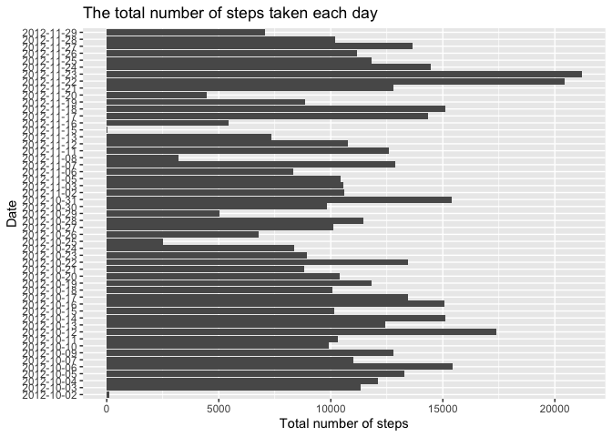
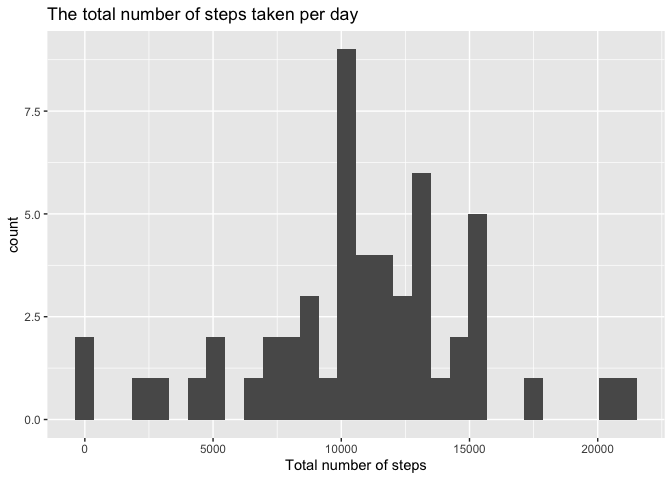
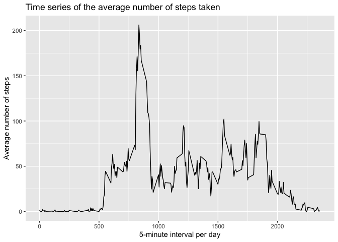
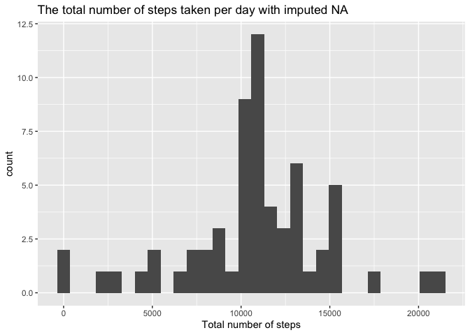
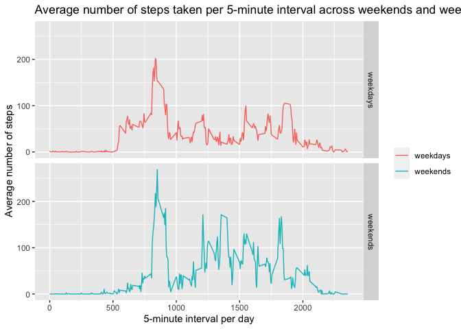

## Loading and preprocessing the data

Load the data using read.csv() and drop the missing data for my analysis:


```r
library(dplyr)
```

```
## 
## Attaching package: 'dplyr'
```

```
## The following objects are masked from 'package:stats':
## 
##     filter, lag
```

```
## The following objects are masked from 'package:base':
## 
##     intersect, setdiff, setequal, union
```

```r
library(ggplot2)
```

```
## Warning: package 'ggplot2' was built under R version 3.6.2
```

```r
library(lubridate)
```

```
## Warning: package 'lubridate' was built under R version 3.6.2
```

```
## 
## Attaching package: 'lubridate'
```

```
## The following objects are masked from 'package:dplyr':
## 
##     intersect, setdiff, union
```

```
## The following objects are masked from 'package:base':
## 
##     date, intersect, setdiff, union
```

```r
rowdata <- read.csv("/Users/macbookpro/Documents/GitHub/RepData_PeerAssessment1/activity.csv", sep = ",", header = TRUE)
rowdata$steps <- as.numeric(as.character(rowdata$steps))
newdata <- rowdata[complete.cases(rowdata),]
```

## What is mean total number of steps taken per day?

To answer this question, I calculate the total number of steps taken per day (Although I understand this task asking for the total number of steps taken EACH DAY (see the expression in the *Commit containing full submission*), so I plot a bar for the steps number for each day (the first plot) and a histogram for the average step number for one day (the second plot).). Then I calculate and report the mean and median of the total number of steps taken per day.


```r
sum <- aggregate(newdata$steps, by = list(newdata$date), sum)

# make a bar plot for the total number of steps for each day:
ggplot(sum) + geom_bar(aes(x, Group.1), stat="identity") + labs(title = "The total number of steps taken each day", x = "Total number of steps", y = "Date") 
```

<!-- -->

```r
# make a histograum with 30 bins:
ggplot(data = sum, aes(x)) + geom_histogram(bins = 30) + 
        labs(title = "The total number of steps taken per day", x = "Total number of steps")
```

<!-- -->

```r
# calculate the mean and median number of the steps per day:
mean(sum$x)
```

```
## [1] 10766.19
```

```r
median(sum$x)
```

```
## [1] 10765
```
So the mean and median of the total number of steps taken per day are 10766.19 and 10765.

## What is the average daily activity pattern?

For this question I will make a time series plot of the 5-minute interval (x-axis) and the average number of steps taken, averaged across all days (y-axis):


```r
# make a line plot for the average number of steps taken:
mean <- aggregate(newdata$steps, by = list(newdata$interval), mean)

ggplot(mean) + geom_line(aes(Group.1, x), stat="identity") + 
        labs(title = "Time series of the average number of steps taken",
             y = "Average number of steps", x = "5-minute interval per day") + xlim(0,2360)
```

<!-- -->

```r
# find the 5-minute interval containing the maximum number of steps
mean[which.max(mean$x),]
```

```
##     Group.1        x
## 104     835 206.1698
```

So the 835-839 internal contains the maximum number of steps.

## Imputing missing values


```r
# total number of missing values in the dataset:
sum(is.na(rowdata))
```

```
## [1] 2304
```

```r
mean(is.na(rowdata$steps))
```

```
## [1] 0.1311475
```

```r
# I use the mean for the corresponding 5-minute interval to imput the missing value:
data_na <- rowdata %>% group_by(interval) %>%
mutate(steps_na = ifelse(is.na(steps), mean(steps,na.rm=TRUE), steps))

# make a histogram of the total number of steps taken each day with imputed missing value:
sum_na <- aggregate(data_na$steps_na, by = list(data_na$date), sum)

ggplot(data = sum_na, aes(x)) + geom_histogram(bins = 30) + 
        labs(title = "The total number of steps taken per day with imputed NA", x = "Total number of steps")
```

<!-- -->

```r
# calculate the mean and median number:
mean(sum_na$x)
```

```
## [1] 10766.19
```

```r
median(sum_na$x)
```

```
## [1] 10766.19
```
So there are 2304 missing values, which is about 13.12% in the dataset. The mean and median of the total number of steps taken per day with imputed missing value are 10766.19 and 10766.19. The values differ from the estimates from the first part of the assignment. The impact of imputing missing data on the estimates of the total daily number of steps is that the median number becomes a little bit higher than the number in the dataset deleting the missing value.

## Are there differences in activity patterns between weekdays and weekends?


```r
# create a new factor variable in the dataset with two levels – “weekday” and “weekend” indicating whether a given date is a weekday or weekend day
data8 <- newdata %>% mutate(wday = wday(as.Date(as.character(date))))

data8_days <- data8 %>% filter(wday == 1 | wday == 2 | wday == 3 | wday == 4 | wday == 5) %>% group_by(interval) %>% mutate(steps_avg = mean(steps), weekday = "weekdays") %>% select("steps_avg", "interval","weekday") 

data8_ends <- data8 %>% filter(wday == 6 | wday == 7) %>% group_by(interval) %>% mutate(steps_avg = mean(steps), weekday = "weekends") %>% select("steps_avg", "interval", "weekday") 

tidydata <- rbind(data8_days, data8_ends)

# Make a panel plot to compare the average number of steps taken per 5-minute interval across weekends and weekends:
ggplot(tidydata) + geom_line(aes(x=interval, y=steps_avg, color = weekday), stat="identity") + labs(title = "Average number of steps taken per 5-minute interval across weekends and weekends", x = "5-minute interval per day", y = "Average number of steps") + xlim(0,2360) + facet_grid(weekday ~ .) + theme(legend.title = element_blank())
```

<!-- -->

